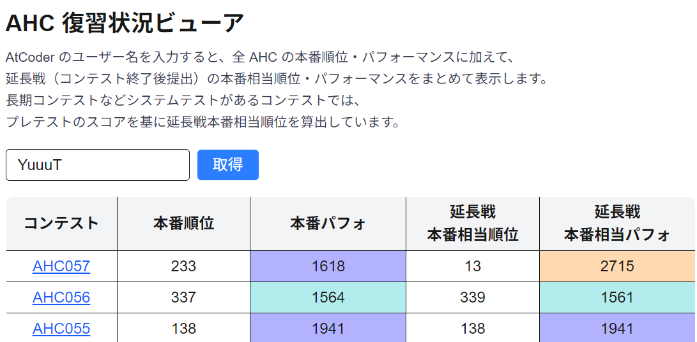

# AHC Result Viewer

AHC（AtCoder Heuristic Contest）の本番順位・パフォーマンスと、延長戦（本番終了後提出）のスコアをまとめて眺められるビューアです。
Next.js をフロントエンド、FastAPI をバックエンドとして構成しています。

## 機能

- ユーザー名を入力すると、全 AHC の本番/延長戦の結果をテーブル表示
- `results/json` と `standings/extended/json` を事前に保存したローカルデータからレスポンスを生成
- 延長戦の最高スコアを本番のスコア分布に当て込み、本番相当の順位・パフォーマンスを算出

## 参考

- https://github.com/qropa/extended-gp30-ranking
